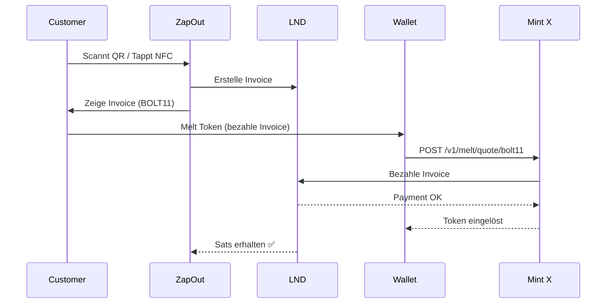

# Helmut's Cashu Mint - Setup & Service

> **Status:** Running on Helmut (cdk-mintd v0.15.0)
> **Letzte Aktualisierung:** 2026-03-19

---

## 🏦 Helmut Cashu Mint

### Setup Details

| Property        | Value                                                                |
| --------------- | -------------------------------------------------------------------- |
| **URL**         | `http://100.74.149.69:3338`                                          |
| **Pubkey**      | `03701fab79eb1c2b703fa8395c8e3c0e8304b99fe9e6f7f8bdcd5c985fb907a41c` |
| **Version**     | cdk-mintd/0.15.0                                                     |
| **LND Backend** | Helmut's SynapseLN (3 channels)                                      |
| **Port**        | 3338                                                                 |
| **Network**     | Bitcoin Mainnet                                                      |

### Supported NUTs

| NUT    | Name              | Status        |
| ------ | ----------------- | ------------- |
| NUT-04 | Mint Quote        | ✅            |
| NUT-05 | Melt              | ✅            |
| NUT-07 | Spendable Outputs | ✅            |
| NUT-08 | Check Spendable   | ✅            |
| NUT-09 | Restore           | ✅            |
| NUT-10 | Split             | ✅            |
| NUT-11 | Token JSON        | ✅            |
| NUT-12 | TokenV2 JSON      | ✅            |
| NUT-14 | Melt Quote        | ✅            |
| NUT-15 | Mint Quote BOLT11 | ✅            |
| NUT-17 | Bolt11 Melt Quote | ✅            |
| NUT-19 | Cached Responses  | ✅ (TTL: 60s) |
| NUT-20 | Proof of Invoice  | ✅            |

### Limits

- **Min Amount:** 1 sat
- **Max Amount:** 500,000 sat
- **Unit:** sat (only)

---

## 🔧 Technical Setup

### cdk-mintd Configuration

**Location:** `/home/umbrel/.cdk-mintd/config.toml`

```toml
[info]
url = "http://localhost:3338"
listen_host = "0.0.0.0"
listen_port = 3338
mnemonic = "<BIP39 seed words>"

[ln]
ln_backend = "lnd"

[lnd]
address = "https://localhost:8080"
cert_file = "/home/umbrel/tls.cert"
macaroon_file = "/home/umbrel/umbrel/app-data/lightning/data/lnd/data/chain/bitcoin/mainnet/admin.macaroon"
fee_percent = 0.0
```

### LND Connection

- **gRPC Port:** 10009 (internal)
- **REST Port:** 8080 (internal)
- **macaroon:** admin.macaroon
- **Node:** SynapseLN

### Process Management

```bash
# Status prüfen
ps aux | grep cdk-mintd

# Logs
journalctl --user -u cdk-mintd

# Neustart
systemctl --user restart cdk-mintd
```

---

## 💡 Swap to Lightning - Analyse

### Das Problem

**Cross-Mint Swap** (Customer Token von Mint X → Lightning auf unserem LND) ist komplexer als erwartet:

```
1. Customer hat Token von Mint X (z.B. testnut.cashu.space)
2. Mint X bezahlt unsere LND Invoice
3. Problem: Mint X muss Lightning haben UND externe Invoices akzeptieren
```

### Swap-Optionen

| Option             | Aufwand | Status     | Notes                                     |
| ------------------ | ------- | ---------- | ----------------------------------------- |
| **Melt at Mint**   | Mittel  | ⚠️ Komplex | Mint braucht Lightning + externe Invoices |
| **Submarine Swap** | Hoch    | 📋 Future  | Braucht专门的 Swap Service                |
| **Same-Mint only** | Niedrig | ✅ Jetzt   | Nur Helmut's Mint akzeptieren             |
| **Numo Bridge**    | Hoch    | 📋 Future  | Fork Numo's Swap Engine                   |

### NUT-05 Melt Flow



### Warum die meisten Mints nicht funktionieren

1. **testnut.cashu.space**: FakeWallet - simuliert nur, kein echtes Lightning
2. **Public Mints**: Offline oder hinter Firewall nicht erreichbar
3. **LNBits Mints**: Viele nutzen VoidWallet (kein echtes Lightning)
4. **Real Lightning Mints**: Erfordern selbst-gehostetes Setup mit echten Channels

---

## 🚀 Helmut Mint als Service

### Idee: Managed Cashu Mint Hosting

**Hypothesis:** Viele Menschen/ Businesses wollen Cashu nutzen, aber:

- Keine Zeit/Lust einen eigenen Server zu betreiben
- Wissen nicht wie man cdk-mintd konfiguriert
- Haben keinen Lightning Node

**Lösung:** Wir bieten einen "Managed Cashu Mint" Service an.

### Service-Modelle

#### Modell A: Full Managed Mint

| Aspekt             | Details                                      |
| ------------------ | -------------------------------------------- |
| **Was**            | Kompletter Cashu Mint auf Helmut's Server    |
| **Kunde**          | zahlt einmalig X € für Setup + monatlich Y € |
| **Inklusive**      | Mint Konfiguration, Monitoring, Backups      |
| **Vorraussetzung** | Kunde braucht eigenen Lightning Node         |
| **Preis**          | ~50€ Setup + 10€/Monat                       |

#### Modell B: Mint + LND Bundle

| Aspekt        | Details                                     |
| ------------- | ------------------------------------------- |
| **Was**       | Mint + Lightning Node (LND) zusammen        |
| **Kunde**     | Hat keinen Lightning Node                   |
| **Inklusive** | Helmut's LND mit gemeinsamen Channels       |
| **Risiko**    | Shared Lightning - Gebühren-Choices wichtig |
| **Preis**     | ~100€ Setup + 20€/Monat                     |

#### Modell C: White-Label POS Integration

| Aspekt        | Details                                 |
| ------------- | --------------------------------------- |
| **Was**       | Komplette ZapOut Installation           |
| **Kunde**     | Will Cashu POS, keine Eigenentwicklung  |
| **Inklusive** | Mint + POS + Dashboard + EUR Settlement |
| **Preis**     | ~200€ Setup + 30€/Monat                 |

### MVP Approach für Service

1. **Testmint auf Helmut** (jetzt) ✅

   - Helmut Mint läuft bereits
   - Noch nicht produktiv (FakeWallet Problem)

2. **Produktiv-Mint Setup**

   - Echte LND Channels
   - Monitoring (Uptime, Fees, Balance)
   - Backup-Strategie

3. **Kommunikation**
   - Landing Page "Cashu Mint Hosting"
   - Preisliste
   - FAQ

### Wettbewerbsanalyse

| Anbieter        | Typ         | Preis  | Notes                         |
| --------------- | ----------- | ------ | ----------------------------- |
| Fedimint        | Community   | Varied | Komplex, andere Tech          |
| Cashu.me        | Cloud       | ?      | Nur Wallet, kein Mint Hosting |
| mutinynet       | Self-Hosted | Free   | Braucht technisches Wissen    |
| **Helmut Mint** | Managed     | TBD    | Einfach, deutsch, Support     |

### Nächste Schritte

- [ ] Produktiv-Mint mit echten LND Channels
- [ ] Monitoring Dashboard für Mint Health
- [ ] Backup System (Seed + State)
- [ ] Landing Page / Pricing Page
- [ ] Erste Pilotkunden?

---

## 📊 Current Status

| Component               | Status                    |
| ----------------------- | ------------------------- |
| Helmut Mint (cdk-mintd) | ✅ Running                |
| LND Integration         | ✅ Working                |
| Mint Quote API          | ✅ Working                |
| Melt API                | ✅ Working                |
| Public Accessibility    | ✅ Port 3338 exposed      |
| Real Lightning          | ⚠️ Braucht echte Channels |
| Monitoring              | 🔴 Fehlt                  |
| Backup                  | 🔴 Fehlt                  |

---

## 🔗 Links

- [cdk-mintd GitHub](https://github.com/cashubtc/cdk)
- [Cashu NUTs Spec](https://github.com/cashubtc/nuts)
- [NUT-03 Swap](https://github.com/cashubtc/nuts/blob/main/03.md)
- [NUT-05 Melt](https://github.com/cashubtc/nuts/blob/main/05.md)
